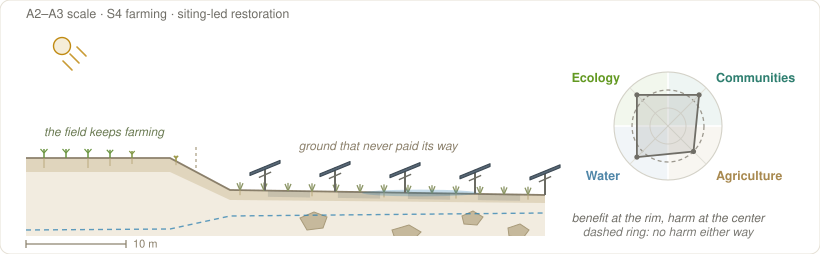
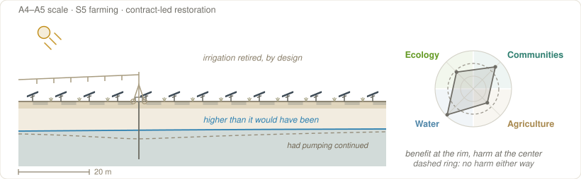

# Archetypal Forms {#sec-archetypes}

Certain designs keep turning up. A farmer's flock under panels, a prairie strip in a wet draw, a retired irrigated field: the same few arrangements appear on ground that has nothing else in common. They recur because the [pressures](terminology.qmd#term-design-pressures) bearing on a project are never evenly matched. [Cost and financing](design-pressures.qmd#sec-pressures) and [energy yield](design-pressures.qmd#sec-pressures) push hardest nearly everywhere, and where nothing pushes back the result is the same array anywhere in the country. Where something does push back, and keeps pushing through permitting and value engineering and the last round of cost cutting, the design settles into a shape that answers it. An [**archetype**](terminology.qmd#term-archetype) is one of those settled shapes. Nobody sets out to build one. The shape is what the pressures leave behind once they have finished arguing, and it is named after the fact, by people counting how often it turns up.

Scale and [farming axis position](terminology.qmd#term-farming-axis) decide which pressures can win. A farmer who owns the herd, the array, and the labor can let [agricultural production](terminology.qmd#term-agricultural-production) beat generation, because the array is sized to the parlor and nobody is asking it to clear a hurdle rate. At five hundred acres that argument has no one to make it, and restoration has to come from how the ground is run instead. This is also why an archetype can disappear: when the policy or the market that let a pressure win is withdrawn, the shape stops being built. Archetypes classify how the pressures were resolved, while [hardware taxonomies](terminology.qmd#term-overhead-interspace) classify what was built, and the two can be read together.

Where the site sits changes which resolutions come cheap, because [a region weights the pressures differently](design-pressures.qmd#sec-regionality). In the irrigated West, retiring fields above an overdrawn aquifer answers a shortage that groundwater law now meters and enforces, which makes it the readiest restorative shape in the region, and the same aridity makes shade worth enough to pay for the extra steel a crop canopy carries. Solar prairie strips answer the runoff from rain-fed Iowa cropland, so where the rain is thin and the water arrives by pump, that form all but drops out.

Six featured archetypes carry a documented case each, ordered from [farmstead](terminology.qmd#term-a1) to [complex](terminology.qmd#term-a5), and seven others are sketched more briefly. The figure below sets them out in another order, left to right by the lever the restorative work fell to, from ownership through structure, management, and siting to contracts, which is the nearest thing that ordering has to a sequence.

 can come out; height is the conflict left standing. The low spots that keep collecting projects are archetypes, six of them named here with their codes. The dashed profile is an arid region.](../figures/fig_archetypes_emerge.svg){#fig-archetypes-emerge}

## Archetypes across scale and position {#sec-scale-position}

Every archetype below carries a compact code under its name: its [zone](scale-transect.qmd#sec-zones) on the scale transect, its [position](farming-axis.qmd#sec-positions) on the farming axis, and its [restoration mode](terminology.qmd#term-restoration-mode), meaning whether the restorative work is carried by the choice of ground, by the array's geometry, by how the site is run, by who holds the asset, or by what the contracts say. So `A1 scale · S1 farming · ownership-led restoration` reads as a farmstead array on ground the farm's own animals keep using, restored by who holds it. The two tables sort the same forms by each coordinate in turn, with **featured archetypes in bold** and [the others](#sec-further-types) in plain text. Arrays mounted on buildings take no ground at all and sit at [A0](scale-transect.qmd#sec-zones), off both tables.

::: {.zone-table}
| Zone | Forms that recur here |
|---|---|
| **A1 — Farmstead** | [**Barnyard Shelter Solar**](#arch-barnyard) |
| **A2 — Commercial** | [**Perennial Crop Canopy**](#arch-permanent-crop) · [Vegetable Agrivoltaics](#arch-vegetable) · [**Marginal Land Solar**](#arch-marginal) · [Solar Fencerows](#arch-vertical-bifacial) · [Pivot-Corner Recharge](#arch-recharge) |
| **A3 — Community** | [**Perennial Crop Canopy**](#arch-permanent-crop) · [**Solar Prairie Strips**](#arch-prairie-strips) · [Vegetable Agrivoltaics](#arch-vegetable) · [**Marginal Land Solar**](#arch-marginal) · [Pollinator Meadow Solar](#arch-community-solar) · [Solar Fencerows](#arch-vertical-bifacial) · [Pivot-Corner Recharge](#arch-recharge) · [Farm-Load Microgrid](#arch-microgrid) · [Brightfield](#arch-brightfield) |
| **A4 — Utility** | [**Perennial Crop Canopy**](#arch-permanent-crop) · [**Regenerative Solar Grazing**](#arch-grazing) · [**Retired-Irrigation Solar**](#arch-water) · [Restored-Grassland Solar](#arch-native-grassland) · [Solar Fencerows](#arch-vertical-bifacial) · [Farm-Load Microgrid](#arch-microgrid) · [Brightfield](#arch-brightfield) |
| **A5 — Complex** | [**Regenerative Solar Grazing**](#arch-grazing) · [**Retired-Irrigation Solar**](#arch-water) · [Restored-Grassland Solar](#arch-native-grassland) · [Brightfield](#arch-brightfield) |
: Which forms recur at each zone. Bold entries are the six developed in full below; the rest are sketched. {#tbl-forms-by-zone}
:::

The crowding at A3 is the [feasible wedge](farming-axis.qmd#sec-wedge) in practical form: it is big enough that management matters and small enough to site strategically ([§-@sec-community-scale](restoration-modes.qmd#sec-community-scale)), so more forms are open there than anywhere else on the [transect](terminology.qmd#term-scale-transect). A listed form has been built at that scale; climate, soil, water, market, and neighbors still decide whether it fits a particular site.

::: {.position-table}
| Position | Forms that sit here |
|---|---|
| **S0 — Created agriculture** | [Brightfield](#arch-brightfield) where the ground layer is grazed |
| **S1 — Primary agriculture** | [**Perennial Crop Canopy**](#arch-permanent-crop) · [Vegetable Agrivoltaics](#arch-vegetable) · [Solar Fencerows](#arch-vertical-bifacial) · [**Barnyard Shelter Solar**](#arch-barnyard) · [**Regenerative Solar Grazing**](#arch-grazing) on ground that was already pasture · [**Marginal Land Solar**](#arch-marginal) where stock stays on |
| **S2 — Secondary agriculture** | [**Regenerative Solar Grazing**](#arch-grazing) on former cropland · [Pollinator Meadow Solar](#arch-community-solar) where hives are kept |
| **S3 — Ordinary-land siting** | [Pollinator Meadow Solar](#arch-community-solar) · [Restored-Grassland Solar](#arch-native-grassland) · [Farm-Load Microgrid](#arch-microgrid) |
| **S4 — Low-productivity siting** | [**Marginal Land Solar**](#arch-marginal) · [Pivot-Corner Recharge](#arch-recharge) · [Brightfield](#arch-brightfield) · [Farm-Load Microgrid](#arch-microgrid) |
| **S5 — Impaired-land siting** | [**Solar Prairie Strips**](#arch-prairie-strips) · [**Retired-Irrigation Solar**](#arch-water) |
: The same forms arranged by what happened to agricultural production, rather than by size. A form appearing at more than one position is one whose ground layer can be run more than one way, or one whose position turns on what the ground carried before it. {#tbl-forms-by-position}
:::

The sharing wing is wider than it looks, and it is wide for two different reasons. Holding a *crop* under panels takes geometry that costs money, which is why only three forms manage it. Keeping a *pasture* takes nothing but the decision to put the array where the stock already were, which is why grazing reaches the largest zones without leaving the sharing wing at all. The sparing wing is where siting does the work. Grazing is the one form that reaches utility scale without giving up a productive ground layer, which is most of why it is the commonest [restorative](terminology.qmd#term-restorative) practice on large arrays.

## Six featured archetypes {#sec-featured}

Each archetype is drawn in section, and each at its own scale, so a farmstead array fills the frame while a regional one runs off both edges. The bar in the lower corner gives the distance, and the panel is the same three-meter table throughout, which is what makes the frames comparable once the bar is read. What changes between them is real: the ground, the [clearance](terminology.qmd#term-clearance), the cover, how deep the roots go, and how much land is in view. Sun falls from the upper left in every frame, so the bands on the ground are where the shade actually lands, offset from the panel that casts it. The [outcomes footprint](restorative-functions.qmd#sec-scale) beside each drawing places the form across Communities, Agriculture, Water, and Ecology. A dominant pressure carries its domain out toward the rim; a yielded pressure pulls it in toward the center; domains the form does not engage sit near the ring. These are judgments about forms, not measurements, and not audits of the named projects.

The figures given for each form are indicative, drawn from the worked case and from forms in circulation, not requirements. Each featured archetype carries one real project. Several rest on developer pages, NGO case studies, and extension write-ups rather than peer-reviewed evidence; capacities and areas are as-reported and are traced in [Sources](sources.qmd). They illustrate the *form*. They are not verified performance data, and none of them has been independently audited against the [restorative functions](restorative-functions.qmd) it is cited for.

### Barnyard Shelter Solar {#arch-barnyard}

[A1](scale-transect.qmd#sec-zones) scale · **[S1](farming-axis.qmd#sec-positions)** farming · *[ownership-led](restoration-modes.qmd#sec-siting-latitude)* restoration

{#fig-arch-barnyard}

Barnyard shelter solar raises roughly 10 to 100 kilowatts of panel over the yard or paddock the farm's own animals already use, on under about an acre. Nothing new has to be established underneath, since the ground layer is the worn yard the stock already stands on. The clearance is set by the animals themselves, high enough that they can walk in and shelter under the array, and the wiring runs behind the meter against the parlor, the cold store, and the well pump. The same farmer holds the animals, the array, and the labor, so nothing has to be written down to align them, and that is what makes the form [ownership-led](restoration-modes.qmd#sec-lv-mode).

What the form gives up is generation at scale, since the array is sized to the farm rather than the grid; agricultural production and [operations and maintenance](terminology.qmd#term-operations-maintenance) are the pressures that set its shape. Shade gathers the herd into one place, so muck and wear concentrate where the animals crowd in, and the ground beneath the panels compacts in a way the open paddock does not. That wear is the farmer's to repair, and it belongs in the same accounting as the power bill the array offsets.

The worked case sits on a University of Minnesota dairy, the West Central Research and Outreach Center at Morris, Minnesota, where a 30-kilowatt array was raised over the pasture in 2018 to shade thirty to forty grazing cows and power the milking equipment. The shaded herd ran about a degree cooler and panted less while the same panels carried the parlor's load, a working demonstration that shelter and generation can sit together on one small farm.

### Perennial Crop Canopy {#arch-permanent-crop}

[A2–A4](scale-transect.qmd#sec-zones) scale · **[S1](farming-axis.qmd#sec-positions)** farming · *[structure-led](restoration-modes.qmd#sec-siting-latitude)* restoration

{#fig-arch-perennial-crop}

Perennial crop canopy carries panels over a planting that is not lifted between harvests: wine and table grapes, tree fruit, trellised canes, and wild blueberry barrens. Projects run from a few hundred kilowatts to several megawatts across roughly 1 to 50 acres, feeding a packhouse and cold store behind the meter or a distribution line beyond it. The geometry follows the crop's own height, from a nearly conventional array over low-growing fruit to a canopy carried four or five meters up on one panel row per crop row, and either way the array is set out on a row spacing the farm already drives.

What makes the form [structure-led](restoration-modes.qmd#sec-lv-mode) is that the crop's life and the array's are the same length. Vines and tree fruit run 25 to 40 years and a wild blueberry stand longer still, so the planting under the panels will be the same planting when the modules come up for replacement. That is a permanence an annual rotation cannot offer: the trellis is already standing, the root system is already down, and nothing has to be worked around a plow. Build cost runs 1.8 to 2.7 times a conventional ground mount, so [cost and financing](terminology.qmd#term-cost-financing) is the pressure the form yields to, and what it defends is [agricultural production](terminology.qmd#term-agricultural-production) on ground good enough that nobody would have sited an array there for any other reason.

The same permanence sets the form's sharpest risk, and it is not shade. A perennial stand cannot be re-established on the array's schedule, so what the machines do to the ground while the piles go in is carried by the crop for years afterward. On the benefit side, fruit-surface cooling is measured, with apple sunburn falling from 13% to 2% at half the radiation [@scalisi2026], and shade holds acidity by preserving turgor [@caravia2016]. The shelter case is weaker: an array is not a roof, so rain exclusion shown under continuous covers does not carry [@yu2022], excluding rain shifts the disease spectrum rather than shrinking it, and after two hail seasons the Austrian trial found the array deflecting stones into the next row.

Maine has the built case at **Maces Pond** in Rockport, where 4.2 megawatts stand on about ten acres of wild blueberry, built in 2021 by BlueWave and owned by Navisun, with five of those acres given over to a University of Maine study running three construction treatments side by side. The early finding is about construction rather than about shade: the blueberries recovered best where the crews went in with the most care. *This is the low-growing end of the form, where the geometry barely departs from a conventional array. The tall canopy over vines and tree fruit is the other end, and Colorado has working examples of it over chardonnay and over peaches.*

### Marginal Land Solar {#arch-marginal}

[A2–A3](scale-transect.qmd#sec-zones) scale · **[S4](farming-axis.qmd#sec-positions)**, or **[S1](farming-axis.qmd#sec-positions)** where stock stays on · *[siting-led](restoration-modes.qmd#sec-siting-latitude)* restoration

{#fig-arch-marginal}

[Marginal land](terminology.qmd#term-marginal-land) solar takes the flood-prone corners, rocky headlands, and wet remnants that no longer pay their way, and leaves the better fields to farm. Arrays run from about 100 kilowatts to 3 megawatts on roughly 1 to 20 acres, sized by what the odd parcel will hold. The ground keeps whatever it supports, rough grazing where it drains and naturalized or pollinator cover where it does not, and where stock still walks beneath the panels the form sits on the sharing wing rather than at S4 — at [S1](farming-axis.qmd#sec-positions) where the ground was already rough grazing, at S2 where it was cropped before. Orientation and layout follow the shape of the ground, not the optimum, and the power goes behind the meter or onto distribution.

What made a parcel marginal for farming often makes it marginal for solar: ballast on rock, an array elevated above a floodplain, extra cable down a long interconnect run to reach the line. [Cost and financing](terminology.qmd#term-cost-financing) is the pressure that dominates, for exactly that reason, and generation is what gets yielded, since ground shaped by water and stone is rarely shaped for output. What the form is for is the [community & economic function](restorative-functions.qmd#sec-fn-community), income off acres that were not paying, and that income has to clear the added cost before the array is worth building.

At Cozy Cove Farm in Gurley, Alabama, a llama-and-alpaca farm set a 50-kilowatt array on a flood-prone corner of riverside pasture, raised about seven feet so the herd grazes and shelters beneath it, and sells the power to the TVA while the pasture keeps working. *This particular site reads as [S1](farming-axis.qmd#sec-positions), not S4: the siting decision was the marginal corner, but the ground was riverside pasture before the array and is riverside pasture under it, so the use it had is the use it kept. It is the archetype's sharing variant, and the reading rule in §-@sec-positions settles it.*

### Solar Prairie Strips {#arch-prairie-strips}

[A3](scale-transect.qmd#sec-zones) scale · **[S5](farming-axis.qmd#sec-positions)** farming · *[siting-led](restoration-modes.qmd#sec-siting-latitude)* restoration

{#fig-arch-prairie-strips}

Solar prairie strips pair a distribution-scale array, roughly one to five megawatts across six to thirty acres, with deep-rooted native prairie planted where a field sheds water: contour bands, low draws, wet corners, and wetland edges. The mix and the width of each band are sized to a named hydrologic outcome. That ground leaves production, and what grows on it slows runoff and holds sediment and nutrients, while the array, often sold as [community solar](terminology.qmd#term-community-solar), pays for the planting. STRIPS research found that converting about a tenth of a field to prairie in the right places can cut soil loss by more than 90% [@schulte2017].

What organizes the form is [restorative goals](terminology.qmd#term-restorative-goals), with community acceptance behind it, and what it gives up is a little generation, handed to the prairie. It also needs a place where clean water is actually paid for, since the strips cost acres and seed whether or not anyone values what they hold back. The logic does not carry to utility scale. Placement this precise is a middle-of-the-transect instrument, and at a few hundred acres the ground is chosen by the [substation](terminology.qmd#term-substation) and the land market instead.

Minnesota has a built case in **Ramsey Renewable Station**, where 3.4 megawatts of solar and storage sit on a native [ground layer](terminology.qmd#term-ground-layer) that is the stormwater system itself: on that sandy soil, DOE's PV-SMaRT modeling found the planting absorbed the 2-, 10-, and 100-year design storms with no detention basins at all.

### Regenerative Solar Grazing {#arch-grazing}

[A4–A5](scale-transect.qmd#sec-zones) scale · **[S1–S2](farming-axis.qmd#sec-positions)** farming · *[management-led](restoration-modes.qmd#sec-siting-latitude)* restoration

{#fig-arch-grazing}

Regenerative [solar grazing](terminology.qmd#term-rangevoltaics) runs a planned flock rotation under a [utility-scale](terminology.qmd#term-utility-scale) array, 5 megawatts and up, across tens of acres to several thousand, connected at sub-transmission or transmission voltage. The ground layer is managed pasture or forage; the fence and gate lines draw the rotation cells, and clearance and water points settle what class of stock can work beneath, which in practice means sheep. The flock is usually hired in, a [contracted service](terminology.qmd#term-contract-grazing) rather than the farm's own animals. Rotation manages vegetation, cycles nutrients, holds ground cover, and can build soil carbon under a well-managed native understory [@krasner2025].

The pressures that shape it are [energy yield](terminology.qmd#term-energy-yield) and operations and maintenance, and what it gives up is the farm's own agricultural production, since the grazing is a tenancy on the array's ground and not the operation of the place. Two calendars have to be reconciled: the plant wants the grass low on its own schedule, and the shepherd moves stock on the flock's. Grazing can reach cost parity with mowing [@mccall2023], which is the level to plan around, because a site budgeted on the expectation of a saving will come up short.

One built case runs across Minnesota, where Aurora Solar's 150 megawatts of generation sit on sixteen sites whose grounds are kept by thousands of contracted sheep grazing a low pollinator understory.

### Retired-Irrigation Solar {#arch-water}

[A4–A5](scale-transect.qmd#sec-zones) scale · **[S5](farming-axis.qmd#sec-positions)** farming · *[contract-led](restoration-modes.qmd#sec-siting-latitude)* restoration

{#fig-arch-retired-irrigation}

Retired-irrigation solar takes irrigated fields above an overdrawn aquifer out of production and puts a large array on them [@stid2025], commonly 50 megawatts and up across hundreds to many thousands of acres, connected at transmission. The panels need no water, so a low-water cover takes the place of the crop. The land it suits is drainage-impaired, salt-affected, or otherwise marginal irrigated ground, and the unit of design is the district or the aquifer rather than the parcel, which is why the form is regional: the impairment it answers is regional too.

The design answers to a water-quantity target and to cost and financing, and it gives up agricultural production by design, since the point of the form is that the irrigation stops. That trade is worth making only where the overdraft is measured and where governance holds the saved water in the aquifer instead of letting it move to another well [@zwickle2021]. That is what makes the form [contract-led](restoration-modes.qmd#sec-lv-mode) rather than siting-led: choosing the ground takes the fields out of production, but only retiring the water right keeps the water in the aquifer, and a right is an instrument rather than a place. Where the metering and the rules are loose, the fields still come out of production, the water does not stay saved, and a district has given up its farming for a benefit that never arrives.

In the San Joaquin Valley of California, **Westlands Solar Park** is part of a plan to convert up to ~136,000 acres of drainage-impaired, previously-irrigated land to solar and storage under the state's Sustainable Groundwater Management Act; because the panels use no water, retiring the fields eases the overdraft that irrigated farming had driven [@stid2022]. *Figures are developer- and program-reported; see [Sources](sources.qmd).*

## Other notable archetypes {#sec-further-types}

Seven more forms, sketched rather than worked through, applying the same language to configurations the featured six do not cover. None of them rests on a run of documented projects that has settled what it delivers: each is named because someone is building or testing it and the vocabulary should reach it. That caveat covers the whole set, so the entries below say what the form is and what is still open about it, and leave the hedging here.

### Solar Fencerows {#arch-vertical-bifacial}

[A2–A4](scale-transect.qmd#sec-zones) scale · **[S1](farming-axis.qmd#sec-positions)** farming · *[structure-led](restoration-modes.qmd#sec-siting-latitude)* restoration

Solar fencerows stand bifacial modules vertically in rows facing east and west, catching morning and evening sun and leaving the ground between them in crop. The rows run wide, around 8 m, because the machinery sets the spacing and the crop's light budget does not [@vaverkova2026]. That geometry gives the clean annual-arable [S1](farming-axis.qmd#sec-positions) case overhead arrays miss. Frameless glass–glass modules and more posts per watt raise the build cost and thin the watts per acre, and whether an arable rotation can carry that premium on its own is unsettled.

### Pollinator Meadow Solar {#arch-community-solar}

[A3](scale-transect.qmd#sec-zones) scale · **[S3](farming-axis.qmd#sec-positions)** farming · *[management-led](restoration-modes.qmd#sec-siting-latitude)* restoration

Pollinator meadow solar seeds the whole site to a native [ground layer](terminology.qmd#term-ground-layer) and times mowing or grazing around bloom [@blaydes2022]. What holds the form together is the buying side: community-solar subscribers and pollinator-habitat certification give the planting a channel that pays for it [@epri2021]. Establishment takes several years and costs more to manage in that window than mowed turf, and how much of the habitat value persists once the site drops into routine maintenance is the part nobody has followed long enough to say.

### Restored-Grassland Solar {#arch-native-grassland}

[A4–A5](scale-transect.qmd#sec-zones) scale · **[S3](farming-axis.qmd#sec-positions)** farming · *[management-led](restoration-modes.qmd#sec-siting-latitude)* restoration

Restored-grassland solar puts a native seed mix under a large array and runs it on deferred or rotational mowing, treating the site as grassland restoration that happens to generate [@walston2025]. Row cropping ends, and the soil-carbon claim rides on the perennial cover that replaces it [@krasner2025; @carvalho2024]. It is the characteristic large-scale [convergence case](farming-axis.qmd#sec-wedge) (§-@sec-wedge), and how many years a seeding needs before it reaches the condition the studies report is the open question.

### Pivot-Corner Recharge {#arch-recharge}

[A2–A3](scale-transect.qmd#sec-zones) scale · **[S4](farming-axis.qmd#sec-positions)** farming · *[siting-led](restoration-modes.qmd#sec-siting-latitude)* restoration

Pivot-corner recharge takes the dry corners a center pivot never reaches, ground already out of production, and grades them to send rainfall downward instead of off [@yavari2022]. The corners are small and awkward, so the generation is minor and what pays is a lease on ground that earned nothing. It is the supply-side counterpart to [retired-irrigation solar](#arch-water), which subtracts pumping demand across a district while this adds recharge on a few acres and the pivot circle keeps farming beside it. Kansas Geological Survey, Kansas State, and Michigan State researchers are testing it over the Ogallala; how much of that infiltration reaches the aquifer is the open question.

### Farm-Load Microgrid {#arch-microgrid}

[A3–A4](scale-transect.qmd#sec-zones) scale · **[S3–S4](farming-axis.qmd#sec-positions)** farming · *[siting-led](restoration-modes.qmd#sec-siting-latitude)* restoration

A farm-load microgrid is sited against a heavy on-farm load, grain drying, cold storage, a feedlot, or a processing complex, with battery storage sized to shave peaks, ride through outages, or arbitrage time-of-use rates. The load is the [offtake](terminology.qmd#term-offtake), which makes this the one form here organized around *when* power is used instead of around what the ground does, and the [community & economic function](restorative-functions.qmd#sec-fn-community) shows up as resilience rather than as rent. The ground layer is rarely the point at an industrial yard, and the storage economics depend on rate structures that can be rewritten.

### Vegetable Agrivoltaics {#arch-vegetable}

[A2–A3](scale-transect.qmd#sec-zones) scale · **[S1](farming-axis.qmd#sec-positions)** farming · *[structure-led](restoration-modes.qmd#sec-siting-latitude)* restoration

Vegetable [agrivoltaics](terminology.qmd#term-agrivoltaics) keeps shade-tolerant food crops growing beneath raised, widely spaced panels: greens, tomatoes, peppers, the things a market garden already sells. Clearance is set by hand work and small equipment, and row pitch by how much light the crop needs rather than by how tightly the parcel could be packed. It is the most engineering-intensive configuration named in this chapter and the most sensitive to climate, since shade past the crop's tolerance cuts yield while in hot, dry settings that same shade eases heat and water stress [@barrongafford2019]. It is also the most studied, with Jack's Solar Garden in Colorado running 1.2 megawatts of [tracking](terminology.qmd#term-tracking-curtailment) panels over four acres as a research site for NREL, Colorado State, and University of Arizona researchers. What is open is whether the form recurs once research funding is not part of the budget, because an annual rotation has to earn back permanent structure every season, which is the trade a [perennial planting](#arch-permanent-crop) is not asked to make.

### Brightfield {#arch-brightfield}

[A3–A5](scale-transect.qmd#sec-zones) scale · **[S4](farming-axis.qmd#sec-positions)**, or **[S0](farming-axis.qmd#sec-positions)** where the ground layer is grazed · *[siting-led](restoration-modes.qmd#sec-siting-latitude)* restoration

A brightfield puts an array on reclaimed mine land, a closed landfill, or a brownfield [@hernandez2019], ground that is cheap because nothing else will take it and welcome because the neighbors have watched it sit idle. Where remediation leaves a ground layer a flock can work, the site reads [S0](farming-axis.qmd#sec-positions) rather than S4, because the array brought a use to ground that had none. Remediation drives the engineering, constraining what foundations can go in and what the ground layer can be, and constrained sites give up some generation. It is the standing [S4-at-A5 exception](farming-axis.qmd#sec-wedge) (§-@sec-wedge), and whether enough such ground sits near enough to [interconnection](terminology.qmd#term-interconnection) to matter at regional scale is unresolved.
