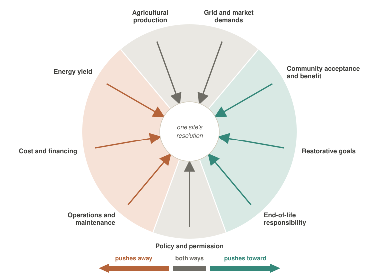

# Design Pressures {#sec-pressures-ch}

The developer, neighbor, farmer, buyer, and county do not want the same thing from a solar project. The developer needs a simple rectangle it can build at the price it bid. The farmer needs clearance for a tractor and a lease that runs as long as the array. The neighbor wants a screen along the road, the buyer wants the credits its scorecard counts, and the county wants the tax revenue and its own setbacks observed. Every project settles those claims one way or another, mostly without anyone saying so out loud. The seed mix quietly turns into turf grass, or the permit stalls. This lexicon calls these competing claims the **pressures**: nine forces, each pushing in its own direction and each with someone arguing for it. Naming them turns a vague standoff into a disagreement people can actually have, and shows who ends up carrying whatever the design could not settle.

{#fig-design-pressures}

## The pressures {#sec-pressures}

Nine forces act on every site. Three push toward restoration, three push against it, and which way the remaining three push depends on the site, the buyer, or the county. Restorative goals is the pressure this lexicon exists to advance, but it is still one force among nine, not a score to judge a project by. The third column of the table is the one worth arguing about, because that is where a project's [restorative](terminology.qmd#term-restorative) claim is won or lost. Two pressures can even push the same way and still collide, which is why the argument over [reversibility](terminology.qmd#term-decommissioning) in §-@sec-conflicts is the hardest one.

::: {.pressure-table}
| Pressure | What it asks for | Push on restoration |
|:--|:--|:--|
| **Restorative goals** | Wider rows, mixed ground cover, a plan covering all thirty years, and choices made for the sake of what grows underneath [@hernandez2019] | **Toward.** The one this document argues for. It still loses to the other eight most of the time |
| **Community acceptance and benefit** | Two things, and a design needs both. *Process*: engagement early enough that the answer can still change the design. *Receipts*: [what the project pays back](terminology.qmd#term-community-benefit), such as tax revenue, agreements, subscriptions, local hiring, or part-ownership | **Toward,** mostly. A township that gets a real say usually asks for more than a check. It can also ask for mown grass and a taller fence. And paying people without asking them first buys resentment, not consent [@crawford2022; @ryder2023] |
| **End-of-life responsibility** | Removable foundations, less digging, funded [decommissioning](terminology.qmd#term-decommissioning), ground that can go back to what it was | **Toward.** Every trench and every graded acre is soil somebody has to rebuild later. The cheapest decommissioning is the one designed on day one, and the bond is what keeps the cost off the county |
| **Agricultural production** | Clearance for a tractor, room to turn at the end of a row, something worth growing underneath, and a contract the farmer can work within for the project's whole life | **Both.** It is why there are sheep under the panels. It is also why there is no prairie under them: ground that has to grow something salable cannot also be left alone |
| **Grid and market demands** | Whatever the buyer and the grid require: the power contract, the renewable-energy credits, the tax benefits, an interconnection the queue will actually deliver | **Both.** When a buyer's scorecard rewards pollinator habitat, habitat gets planted on a thousand sites at once. When that scorecard was written for a different climate, the wrong seed mix is in the contract for twenty years |
| **Policy and permission** | Whatever the rules require before the project can happen at all: the permitting path, prime-farmland and setback rules, state programs, and the subsidies that decide what pays | **Both.** In California, groundwater law pays a grower to retire irrigated ground. In Iowa, the ethanol mandate pays a grower to keep planting it. Same pressure, opposite instruction, and the state line decides |
| **Operations and maintenance** | Cover that is simple to mow, or gravel that does not grow at all, for twenty-five to forty years | **Away, then toward.** Somebody mows that ground for the next thirty years. Gravel never needs mowing, which is how gravel wins. Natives cost more for three years and less every year after, so which way this pushes depends on how far ahead the owner is looking |
| **Energy yield** | Panels packed close, tilted and turned to follow the sun, mounted low, covering the whole field | **Away.** This is why the standard array looks the way it does: low, tight, edge to edge. Not always opposed, though. Plants under the panels hold the dust down and keep the modules cool, and cool modules make more power [@merheb2025] |
| **Cost and financing** | Standard racking, low mounting, no special site preparation, simple rectangles instead of awkward shapes · a project big enough, and an offtaker sound enough, to raise the money against | **Away,** twice over. Anything unusual costs more and somebody will ask why it is worth it. And the paperwork does not scale down, so the middle of the transect pays a premium per watt for reasons that have nothing to do with how it was built. Sometimes the answer is cheap: siting New York's entire 2050 build around biodiversity came to 0.17% more than the cheapest version [@gallaher2026] |
: The nine pressures and the direction each one pushes. Read the third column as a direction rather than a verdict on anyone advocating it, since every one of the nine has someone arguing for it in good faith. {#tbl-pressures}
:::

A site nobody will [finance](terminology.qmd#term-cost-financing) does not get built, and none of the nine can simply be argued away.

## Where the pressures collide {#sec-conflicts}

Whatever a design leaves unresolved is its **[design tension](terminology.qmd#term-design-tension)**. No combination of [lever](design-levers.qmd) settings brings it to zero, because the nine pressures cannot all be satisfied at once and the project still has to get built. What varies is how much tension is left, and who is left carrying it. A design can be quiet because the pressures genuinely made room for each other, or quiet because one side gave up and went home. The combinations that leave the least tension are the ones that get built again and again, and those are the [archetypal forms](archetypal-forms.qmd).

**[Agricultural production](terminology.qmd#term-agricultural-production) vs. restorative goals.** Should the ground under the panels grow food, or habitat? This is the argument between the American Farmland Trust and the advocates of [ecovoltaics](terminology.qmd#term-ecovoltaics). Requiring crops rules out pollinator plantings, and choosing habitat gives up the case for protecting farmland. Both sides are defending something real, so dismissing either one as a misuse of words settles nothing.

**[Operations and maintenance](terminology.qmd#term-operations-maintenance) vs. everything.** Gravel and herbicide are easy to maintain, and a diverse perennial planting is not. The maintenance bill decides the fate of many restorative designs.

**Grid and market demands vs. [restorative goals](terminology.qmd#term-restorative-goals).** Buyers and their scorecards can spread good [ground-layer](terminology.qmd#term-ground-layer) practice quickly. But a rule written far away can also lock a poor local fit into a contract for its whole term [@epri2021].

**[Energy yield](terminology.qmd#term-energy-yield) vs. restorative goals.** Panel height ([clearance](terminology.qmd#term-clearance)), row spacing, and how much shade a crop can take all affect each other. But plants under the panels can also cool them, keep dust down, and cut how often the panels need washing, so these two pressures sometimes push the same way [@merheb2025].

**Cost and financing vs. operations and maintenance.** These two are often mistaken for one pressure. They split over what to plant, how high to mount the panels, and how equipment gets in, because what is cheap to build is often expensive to keep.

**[End-of-life responsibility](terminology.qmd#term-end-of-life) vs. restorative goals.** This is the hard one, because both pressures push toward restoration and they still collide. Established habitat and rebuilt soil take years to create, and they do not come out cleanly when the array does. A project designed to disappear without a trace and a project designed to heal the ground are not always the same project.

**[Community acceptance and benefit](terminology.qmd#term-community-acceptance) vs. cost and financing.** Community benefit costs money, and money is no substitute for a fair process. The cost is worth calculating rather than assuming. Planning New York's solar around biodiversity came to only 0.17% more than the least-cost plan, though protecting farmland involved other tradeoffs [@gallaher2026].

## The same pressures, weighted by place {#sec-regionality}

The same nine pressures act on every site, but they carry different weight in every region. Shade that relieves a water-stressed crop in Arizona can cut corn yields in Ohio, and [retiring irrigated ground](terminology.qmd#term-s5) above a depleted aquifer has no equivalent in a county where the crops run on rain. The vocabulary travels between regions, but the weights do not. That is why this lexicon argues for an aim and leaves the dimensions to the site.

### Six factors that shift the weights {#sec-rg-factors}

::: {.region-table}
| Factor | What it changes |
|:--|:--|
| []{#sec-rg-resource}**Resource: sun and cloud** | Cloudier regions get more of their light as scattered, [diffuse](terminology.qmd#term-diffuse-fraction) light, which reaches under and between the panels more easily than direct sun, so a [ground layer](terminology.qmd#term-ground-layer) has more to work with. Strong direct sun makes [tracking](terminology.qmd#term-tracking-curtailment) worth more, and makes high clearance and wide rows cost more in lost power |
| **Grid operator** | The [grid market](terminology.qmd#term-grid-market) often decides how big a project will be before the land does. Long waits to connect and forced cutbacks in output make each extra megawatt worth less, which eases the push to pack panels tightly. Where there is no community-solar program, projects skip the middle sizes entirely, and with them the range where the most design choices stay open |
| **Aridity** | Flips the value of shade. In dry, sunny places, crops can trade some light for relief from heat and drought. In humid, temperate places they lose yield with nothing to show for it. Across 367 paired observations, the turning point sits near 30 °C air temperature [@merheb2025]. [Water work](terminology.qmd#term-fn-hydrologic) shifts from cutting water use to catching runoff |
| **Latitude** | Sets the sun angle, and with it the tilt, the row spacing, and the [ground coverage](terminology.qmd#term-gcr). Northern arrays space their rows wider, which gives the ground layer more light and uses more land; southern arrays pack tighter. The resulting gaps between rows ([pore space](terminology.qmd#term-pore-space)) are why [vertical bifacial](terminology.qmd#term-module-technology) panels over working cropland (S1) suit some parts of the country better than others |
| **Cropping system** | Decides whether keeping a crop under the panels is realistic at all. Leafy greens, root vegetables, and many forage grasses tolerate moderate shade. Corn and other warm-season (C4) grains do not, and neither do many fruiting crops, so a corn and soybean region relies on grazing and leases rather than on growing crops under the panels |
| **Irrigation** | Makes [impaired-land siting](terminology.qmd#term-s5) possible where a district pumps more than its aquifer can sustain, because taking fields out of irrigation saves water and solar makes that pay. Rain-fed regions have no irrigation to retire, so their water work is catching runoff instead |
: The six regional factors and what each one changes. The vocabulary travels between regions; the weights do not. {#tbl-regional-factors}
:::

### A worked calibration: the United States {#sec-rg-us}

:::: {.example}
The table below is one [calibration](terminology.qmd#term-regional-calibration) of these factors, offered as a worked example rather than a finding. The regions loosely follow the USDA resource regions and are named so they are easy to recognize. GHI (global horizontal irradiance) is the total sunlight reaching flat ground, and the market column names the regional grid operators, such as CAISO in California and MISO and PJM across the Midwest and East. The last column is where the factors, taken together, tend to push each region.

::: {.region-table}
| Region | Resource & light | Water | Cropping | Market | Tends toward |
|---|---|---|---|---|---|
| **Desert Southwest** | Highest GHI, low diffuse, strong beam | Arid; groundwater-limited | Irrigated specialty, rangeland | CAISO / WECC, large-scale | Shade as a benefit; cropping continues under the panels where irrigated horticulture persists, and irrigation is retired where water is the binding constraint |
| **Central Valley & irrigated West** | High GHI | Arid, and governed under SGMA, California's groundwater law | High-value specialty, heavily irrigated | CAISO, strong offtake | Retiring irrigated ground at scale; [retired-irrigation solar](archetypal-forms.qmd#arch-water) |
| **High Plains** | High GHI, high latitude spread | Ogallala overdraft; declining wells | Grain, cotton, beef | SPP / ERCOT, curtailment risk | Retiring irrigated ground where the aquifer binds; grazing on the large arrays |
| **Corn Belt** | Moderate GHI, moderate diffuse | Rain-fed; runoff and nutrient export | C4 grain, soybean | MISO / PJM, deep queues | Leases and grazing; hydrologic function as interception, via [prairie strips](archetypal-forms.qmd#arch-prairie-strips) and pollinator ground layers |
| **Great Lakes & Northeast** | Lowest GHI, highest diffuse fraction | Humid; drainage, not scarcity | Dairy, forage, vegetables | Community-solar programs, so mid-sized projects are real | Crops and stock kept on the ground at small and community scale; [vegetable agrivoltaics](archetypal-forms.qmd#arch-vegetable), [barnyard shelter](archetypal-forms.qmd#arch-barnyard) |
| **Southeast** | Moderate-to-high GHI, humid and cloudy | Humid; rainfall intensity | Row crop, pasture, poultry | Largely non-ISO, utility-led | Grazing at scale, and leases with managed ground layers |
: One regional calibration of the United States, offered as a worked example rather than a finding. Read each row as a starting hypothesis: a region doing something its profile says it should not is the most useful contribution this chapter can receive. {#tbl-us-calibration}
:::

Read each row as a starting hypothesis, not an assignment. Counterexamples are worth reporting.
::::

### What follows {#sec-rg-consequences}

The pressures stay the same from place to place, but their weights do not, so designs should differ when the sunlight, the grid, the crops, or the water differ. The typical mistake is [copying a solution from another region](terminology.qmd#term-design-import), often through a buyer's [standard requirement](terminology.qmd#term-grid-market) that has traveled farther than the evidence behind it.

What an array replaces also depends on the region, and that changes what an argument for sparing land even means. Nationally, most US solar has gone onto cropland. In New York it has not: of the [utility-scale](terminology.qmd#term-utility-scale) solar built there so far, 48% replaced pasture and hay, 38% replaced cultivated crops, and 11% replaced forest [@gallaher2026]. That puts clearing forest and losing grassland bird habitat at the center of a conversation that in Iowa would be about row crops and fertilizer runoff. A position on the farming axis means the same thing from state to state. What the array displaced does not.

This is why the lexicon prescribes an [aim rather than dimensions](../index.qmd#sec-aim-not-dimensions). Calibrations for other regions are especially welcome. The zone sizes here are typical for the US Midwest, and a region with different sizes, missing zones, or a different limiting factor adds to the lexicon.
