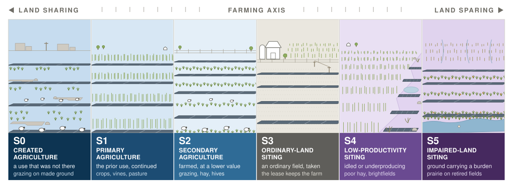

# The Farming Axis {#sec-farming-axis}

From the road, one array looks much like another: same modules, same rows, same fence. The differences are underneath it and beside it, in whether a farm is still taking anything off that ground and in what the ground was doing before the array arrived. The farming axis answers one question: **what happened to [agricultural production](terminology.qmd#term-agricultural-production) on this ground?** Every ground-mounted project occupies one of five positions, S1 through S5, running from **land sharing**, where production continues on the ground the array occupies, to **land sparing**, where ground comes out of production so other ground can be left alone. A sixth position, **S0**, sits past the sharing end for the case the other five cannot read: ground that carried no farming before the array and carries some under it. The axis is largely independent of [scale](scale-transect.qmd): scale says what was available; position says what happened.

**The two halves of the axis are settled by different levers, which is why the names run on two stems.** Where production has stopped, the position is a straight reading of which ground the array took — ordinary, idle, or impaired — and that is a siting decision, so those three are named for the ground. Where production continues, siting has almost nothing to do with it. A flood-prone corner that was rough pasture and still carries the farm's sheep is S1, and the same corner left to naturalize under the panels is S4, on identical ground. What separates them is what is grown and who takes it, so the sharing positions are named for the farming that survives rather than for where anyone put the array.

Most public argument about solar on farmland is an argument about this axis, conducted without it [@moore2022]. About half of the ~3,000 km² (740,000 acres) of US ground-mounted solar was built on former cropland and about a third on agricultural grassland [@kruitwagen2021; @fujita2023], and globally croplands are the prior cover for roughly 59% of PV sites [@merheb2025]. Naming the position first clarifies what a project can claim, what it must still argue for, and which objections apply. The framing borrows the neutrality of conservation ecology's land-sharing and land-sparing debate [@green2005; @phalan2011]; it does not rank positions by definition. The closest existing scheme sorts solar landscapes by design ambition, as mixed-production, nature-based, or landscape-inclusive [@oudes2022]; this axis cuts across all three, because it asks only what happened to production.

{#fig-farming-positions}

## The positions {#sec-positions}

The two agricultural positions are read against what the ground did before, not against what the array needs. **S1** is the use carried on essentially unchanged with the array added to it, which is [agrivoltaics](terminology.qmd#term-agrivoltaics) in the strict sense: a vineyard still a vineyard, a pasture still a pasture, a row crop still cropped between the rows. **S2** is agriculture continued at a lower value than the ground carried before, which in practice is usually [solar grazing](terminology.qmd#term-rangevoltaics) on former cropland, and also covers a sown layer worked for forage, hay, or hives. The same flock therefore reads differently on different ground: sheep on land that was already pasture are S1, and sheep on land that was growing maize are S2, because one use continued and the other stepped down.

Ordinary-land siting is the center of the axis and where most projects sit; direct crop production under panels remains a small share of US installations [@stid2022; @macknick2022]. **S3 is where restoration is socioeconomic before it is biophysical**: the lease sustains the farm enterprise although production stops in the [footprint](terminology.qmd#term-footprint-influence). Where rent reaches a non-farming owner and the operation ends, the site is **[bare conversion](terminology.qmd#term-bare-conversion)**, the non-restorative baseline. The distinction must be made for the landowner and tenant separately (§-@sec-fn-community) [@stid2025].

S4 and S5 both take ground out of production, and differ in [where the benefit goes](terminology.qmd#term-benefit-delivery): S4 spares land not taken, S5 acts on the ground taken and its downstream effects. That difference is why only one of them can be checked where it stands. **S5's benefit lands on the ground the array is standing on; S4's lands on ground the array never reached.** Both names nonetheless record what was sited on, which is what a visitor can check, and leave the sparing claim to the definition. The burden that qualifies a site for S5 has to be a measurable one: chronically low yields, high runoff, nutrient or pesticide export, or irrigation draw beyond the aquifer's budget. Ground positioned where such a burden can be intercepted qualifies on the same reasoning. Prairie plantings on drainage-impaired crop ground illustrate the distinction [@schulte2017].

**One case sits outside all five, and it runs the other way.** The five positions are a ledger of displacement: each records a use kept, a use stepped down, or a use lost, and each is read against what the ground carried before the array. Ground that was built on, paved, filled, or otherwise carrying no agricultural use has nothing to displace, so an array that puts a flock on it is neither holding a use nor stepping one down. It is making one. That is **S0 — created agriculture**, and it sits past the sharing end, because production on the ground the array occupies is what the sharing end means and S0 carries more of it than the ground held before. A capped landfill grazed under panels, a decommissioned industrial parcel carrying sheep, previously developed urban and peri-urban ground put back to stock: all read S0. Its name runs on the sharing stem, for the farming rather than for the ground, since what defines the position is the use that started. The position is uncommon, and naming it makes no claim about quality. A use that began is not automatically a use worth having, and the position records the direction rather than the value.

::: {.position-table}
| Position | The ground beforehand | Production afterward | Typical ground layer | Where the benefit lands |
|---|---|---|---|---|
| **S0 — Created agriculture** | Developed, built, or otherwise carrying no agricultural use | Begins where there was none | Usually grazed; whatever a farm can take something off | On the same ground, and on whoever farms it |
| **S1 — Primary agriculture** | The use it already carried | Continues essentially unchanged | The crop, the vines, or the pasture itself | On the same ground |
| **S2 — Secondary agriculture** | Usually cropland; any ground whose use is stepped down rather than continued | Continues, at a lower value than before | Grazed, cut for forage or hay, or worked for hives | On the same ground, and on the farm working it |
| **S3 — Ordinary-land siting** | Ordinary productive ground | Stops inside the footprint | Whatever is maintained; often mown | On the farm enterprise, through the lease |
| **S4 — Low-productivity siting** | Already idle, marginal, or chronically low-yielding | Had already stopped before the array arrived | Often left to naturalize | On productive land elsewhere that went unbuilt |
| **S5 — Impaired-land siting** | Carrying a measurable off-site burden | Stops, and the burden stops with it | Perennial cover chosen against the burden | On the ground taken, and downstream of it |
: The six positions, and what changes across them. Read left to right, the first two columns settle the position and the last two say what follows from it. {#tbl-positions}
:::

::: {.example}
**Corn-ethanol land: the large American S5 case.** It reverses the usual objection. About 12 million hectares of US cropland, an area the size of New York State, already grows energy rather than food. One hectare of [utility-scale](terminology.qmd#term-utility-scale) array matches the energy of roughly 31 hectares of corn grown for ethanol, so converting 3.2% of that acreage would replace all of its energy and take utility-scale solar from 3.9% to 13% of US supply. Retiring the nutrient-exporting fraction under perennial vegetation would remove an estimated 54.8 million kg of nitrogen and 26.3 million kg of phosphorus from annual application [@sturchio2025croplands].

The substitution is imperfect, because electrons and a fuel additive serve different end uses. But the land arithmetic is not close: this is not food land lost to energy, it is energy land used about thirty times better.
:::

A position records the ground fact, not project quality. Pollinator habitat, prairie, and native grassland are [restorative functions](restorative-functions.qmd), not positions: the same planting can occur at S1 through S5, since a grazed array on former pasture can carry a pollinator understory as readily as a retired field can. What decides the position is whether a farm takes something off it. A sown meadow carrying hives is agriculture, because honey and colonies leave the ground and are sold, which puts it at S2 on the same footing as a flock; the identical meadow without hives is a [ground layer](terminology.qmd#term-ground-layer) doing ecological work on land that stopped farming, which is S3 or below.

::: {.how-to}
**Placing a site.** The positions are exclusive, and two questions in order settle which one applies. Both are asked of the ground, not of the lease.

1. **Is a farm still taking something off this ground?** Name the farm and name what it takes. If the use is essentially the one the ground carried before, the site is **S1**. If a farm still works it but at a lower value than before, the site is **S2**. If the ground carried no agricultural use at all before the array, the site is **S0**, because there was no use to keep and none to step down from. Two things do not count. Rent is not production: it comes out of the contract rather than out of the ground, and a site whose only output is a lease payment is S3. Vegetation that is only mown is not production either, because nothing leaves and no farm takes anything.
2. **If nothing is taken, what was the ground before the array?** Ordinary productive land gives **S3**, ground already idle, marginal, or chronically low-yielding gives **S4**, and ground carrying a measurable off-site burden gives **S5**.

A flood-prone corner that was already rough pasture and still carries the farm's sheep is S1, because the use it had is the use it kept. The same corner cropped before the array and grazed after it is S2, because a farm still works it at a lower value than before. Left to naturalize under the panels, with nothing taken off it, it is S4. S3 asks one further question: does the farm enterprise survive the conversion? If not, it is bare conversion.
:::

Sparing remains a landscape claim. S4 benefits only if [the land left untaken](terminology.qmd#term-displaced-benefit) was the genuine alternative and the array did not move onto something else worth keeping. Siting New York's 2050 build to preserve farmland spares roughly 80% of the farmland a least-cost build would take and opens more than 41,000 hectares of forest doing it, while the least-cost run itself concentrates on pasture and hay, nearly half of which overlaps grassland bird habitat [@gallaher2026]. The array goes somewhere, and a position read at the site alone will not say where. S4 includes unlike sites, from remnants to [brownfields](terminology.qmd#term-marginal-land), whose contamination and permitting constraints still belong in the site description. Building-mounted arrays are [A0](scale-transect.qmd#sec-zones) and hold no position.

Read down the five and they are all answers to one kind of question: what was given up, and by whom. None of them says what the ground goes on to do afterward, which is a second kind of [restorative](terminology.qmd#term-restorative) work and is taken up in §-@sec-harm-benefit.

## Scale and position interact to determine feasibility {#sec-wedge}

Scale narrows the positions available through [siting latitude](restoration-modes.qmd#sec-siting-latitude), and it narrows them at one end only. Farming carries on under panels at every size: at [A1](scale-transect.qmd#sec-zones) it is the operator's own yard, and at [A5](scale-transect.qmd#sec-zones) it is a contracted flock on ground that was already pasture, which is why the sharing edge of the *feasible wedge* runs flat across the whole transect. What is scarce at the small end is sparing: S4 and S5 are available there and spare almost nothing, because the acres involved are too few to stand for anything. The wedge therefore opens downward from A1 to A3 and stays open. The one combination that genuinely thins toward the large end is **S4**: contiguous [land assembly](terminology.qmd#term-land-assembly) near a substation cannot collect scattered remnants, so ground that qualifies gets harder to find as projects grow. S5 does not thin with it, because impairment can be regional and an aquifer district assembles as readily as any other block of ground.

{#fig-feasible-wedge}

Grazing and ordinary-land siting form the spine. Grazing is what holds the sharing edge open at the large end, and it does so on the strength of the prior use rather than on any geometry: a flock on ground that was already pasture is S1, and the same flock on former cropland is S2. What stays genuinely exceptional is *cropping* at utility scale, where the tall clearances and wide rows are hard to justify against cost, with [vertical bifacial](terminology.qmd#term-module-technology) arrays the documented case [@vaverkova2026]; greenhouse photovoltaics at small scale and pre-disturbed land for S4 remain the other two. [Permanent crops](archetypal-forms.qmd#arch-permanent-crop) are a second candidate exception on the sharing wing, since a vineyard or orchard already carries its rows at height and its crop can absorb a [clearance](terminology.qmd#term-clearance) that maize cannot, so a fifty-acre block under a canopy is a primary-agriculture project of some seventeen megawatts. The exception is geometric rather than economic: the structure premium still runs 1.8 to 2.7 times a conventional ground mount, and a trellis holds vines, not [trackers](terminology.qmd#term-tracking-curtailment). Native grassland remains a [restorative function](restorative-functions.qmd), not a position [@walston2025; @krasner2025].

S1 reached by *cropping* is climate- and crop-conditional, in a way S1 reached by carrying on a pasture is not: it is most plausible for shade-tolerant crops in hot, water-limited settings and mixed to negative for staple grains in temperate or humid settings [@barrongafford2019; @weselek2019; @merheb2025].

American Farmland Trust's production-based [dual-use](terminology.qmd#term-dual-use) definition requires S1 or S2. Critics include [ecovoltaics](terminology.qmd#term-ecovoltaics), whose ecological ground layers sit as functions at S3 and below [@hernandez2019]. This document describes that dispute rather than settling it.
