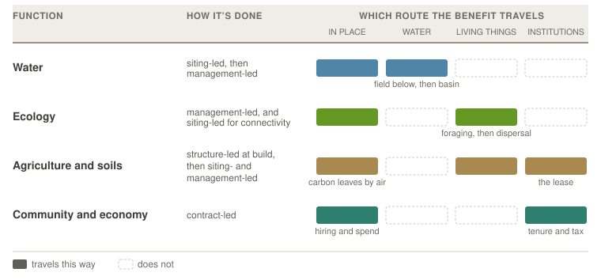

# Restorative Functions and Outcomes {#sec-functions}

Two solar farms in the same county, the same size, the same panels, the same crop ground underneath. Under one, gravel and a herbicide schedule; under the other, a planting rooted deep enough to hold a summer storm where it falls.

Nothing about the land separates them. Where a project sits (§-@sec-transect) and what happened to the farming on it (§-@sec-farming-axis) set the outer limits of what is possible there, but what the ground ends up doing is settled by how the design resolved its competing pressures (§-@sec-pressures-ch), and above all by whether anyone was still pushing for restoration when the cheaper option was on the table.

[*Restorative*](terminology.qmd#term-restorative) is therefore not something a piece of ground is. It is something a design produces, and on most sites it can be produced or withheld. **Restorative functions** name the four things a design can be aimed at.

- **Water** (§-@sec-fn-hydrologic) — what soaks in, what runs off, and what the runoff carries with it
- **Ecology** (§-@sec-fn-biodiversity) — what can live there, and what can move through
- **Agriculture and soils** (§-@sec-fn-agricultural) — what farming gets from it, and what the ground underneath is made of
- **Community and economy** (§-@sec-fn-community) — what the people hosting it actually get

{#fig-functions-overview}

Read the table by route rather than by distance. Carbon is the exception the drawing cannot hold, leaving by air to everywhere and no one in particular, and land sparing is missing for a different reason: nothing travels at all, because its benefit is ground that stayed as it was (§-@sec-benefit-range).

**Microclimate is not on the list, and used to be.** The shade is real and among the best-evidenced things an array does: daytime soil and canopy temperatures fall, nighttime minima rise, and vapor-pressure deficit drops [@sturchio2023; @pinos2026; @barrongafford2019]. But it is a mechanism rather than an outcome, and its results are already counted elsewhere. Retained soil moisture is the water function. Thermal refuge for what lives under the panels is ecology. Relief for a shade-tolerant crop, shelter for stock, and shade for the people working there are agriculture. Naming it separately counted the same shade twice, which is why the vocabulary keeps [microclimate modification](terminology.qmd#term-microclimate) as a term for the mechanism and drops it as a function.

**A function is not a position on the [farming axis](terminology.qmd#term-farming-axis).** A project holds one position, which records what happened to [agricultural production](terminology.qmd#term-agricultural-production) on its ground. It can deliver several functions at once, and the same function turns up at many positions: pollinator habitat is reachable under grazing (S1–S2, depending on what the ground carried before), on ordinary converted ground (S3), and on spared or retired ground (S4–S5) alike. Position narrows the set only where the ground is tilled every year, which rules out the functions that need an undisturbed [ground layer](terminology.qmd#term-ground-layer) — and that is a fact about cropping rather than about a position, since S1 also covers pastures and orchards that are never ploughed. The three registers stay distinct: a [pressure](terminology.qmd#term-design-pressures) is a force pushing on the design, a [lever](terminology.qmd#term-design-levers) is something the design does about it, and a function is the result the two produce. Treat the four as a palette rather than a scorecard, since no project delivers all of them and some work against each other.

**Two accounts, both needed.** The [farming axis](farming-axis.qmd#sec-positions) is largely a ledger of [harm reduced](restoration-modes.qmd#sec-harm-benefit), since every position it records answers a question about displacement. These functions are where benefit gets promoted. The water function runs both ways at once and shows what the difference costs, because **avoided loading** needs the ground that was leaching while **interception** needs the ground below it, so one objective sends a designer to opposite parts of the same farm. The two are checked differently, too: a benefit can be gone to and looked at, while an avoided harm has to be argued against what would otherwise have happened. Neither ranks above the other, and on ground that was doing real damage, ending it is the larger result.

**A note on "co-benefits."** The field usually calls these [co-benefits](terminology.qmd#term-cobenefit), and that grammar demotes what it names, since a *co-*benefit is something arriving alongside the real objective [@mayrhofer2016]. The functions below are named as objectives instead.

## Water {#sec-fn-hydrologic}

An array changes what happens to rain before it leaves, and what the water carries when it goes.

**Quantity** is the site's water balance. Panels intercept rainfall and concentrate it along drip lines while sheltering the ground beneath, shade cuts evaporation and transpiration so soil moisture is generally retained, and cover and grading decide how much infiltrates. At scale the more consequential effect is on the *budget* rather than the balance: where solar displaces irrigated cropland it retires that field's consumptive use and eases an aquifer across a whole management area [@stid2022; @stid2025], which holds only where groundwater governance keeps the saving from being pumped somewhere else [@zwickle2021].

**Quality** has two routes that want opposite ground. **Avoided loading** stops the source, by putting the array on ground that was leaching so the fertilizer and pesticide programs stop with the cropping; on corn-ethanol acreage with documented nutrient export, retiring it under unfertilized perennial cover would take an estimated 54.8 million kg of nitrogen and 26.3 million kg of phosphorus out of annual application [@sturchio2025croplands]. **Interception** treats what is already moving, by setting perennial vegetation where runoff passes so it catches sediment, nutrients, and the pesticide fraction bound to that sediment, which is the documented function of prairie strips in corn–soybean cropland [@schulte2017]. Avoided loading needs the impaired field itself and competes with farming it; interception needs ground below that field and works whether or not the field ever changes. Which one is available is settled by placement, not management, so water is the function [siting latitude](terminology.qmd#term-siting-latitude) buys the most of.

A creek below a twenty-acre array runs on water from several thousand acres, and twenty acres of changed cover does not show up in it. The same twenty acres draining one hollow does. That ratio is what the STRIPS work measured: a tenth of a field, planted where the water leaves it, held back more than 90% of the soil that used to go with it [@schulte2017]. So what a watershed notices is not the size of the array but how much of the ground draining past it the array sits on, and a small project can matter more than a large one built somewhere the water is already diluted.

Size changes the shape of the flow as well. A few rows shed along their drip lines and the water leaves the way it always did, spread along the whole field edge. Put two thousand acres inside one fence and the same water arrives at a handful of culverts, in less time and in a smaller place. [Ramsey Renewable Station](archetypal-forms.qmd#arch-prairie-strips) absorbed the 100-year storm on sand at 3.4 megawatts. The same seed mix on tight soil, draining a bigger block to fewer outlets, is a harder storm to hold.

Water travels, so its benefits do. Moisture is held **in place**; slowed runoff and held-back sediment reach the field, the road, and the ditch immediately below before they reach anything further, which is the nearest and most checkable form this function takes; and retired consumptive use is felt across a basin. Direction decides all of it. Ground upslope of a problem can fix it and identical ground downslope cannot.

## Ecology {#sec-fn-biodiversity}

Two halves: what can live on the ground, and what can reach it.

**Habitat** is built from the ground layer up. Floral plantings supply nectar and pollen, and the vegetation's vertical and horizontal structure supplies nesting substrate, cover, and the heterogeneity that lets many species partition one site. Panel shade shifts the timing, delaying bloom and increasing late-season floral abundance [@graham2021], and the shelter underneath is thermal refuge in a heat wave. The seed mix sets the ceiling, but *timing* decides what is realized: mowing or grazing during nesting or bloom undoes the resource it was meant to provide, which makes the operational calendar a design lever in its own right [@blaydes2022].

**[Connectivity](terminology.qmd#term-connectivity)** is the other half, and it is designed or destroyed at four scales at once. Inside the array, continuity is broken by things nobody files under habitat design: access roads, gravel aprons, mown strips, and a perimeter fence whose mesh decides which animals pass. At the edge, what matters is whether the planting meets something already connected, since a site joining a fencerow or a riparian strip is part of a network while the same seed mix inside a fence in the middle of row crop is an island. Across a landscape, many small arrays can work as stepping stones where they fall within dispersal distance, while a few large ones give more interior and less edge, and which is better is a question about the species rather than a general rule. At regional range, a fleet under compatible mixes and calendars is a network on paper, and whether it is one in fact is unmeasured (§-@sec-evidence-needs).

The corridor experiments are what make this more than an analogy: connected patches exchange more individuals and accumulate more species over time than isolated patches of equal area, with butterflies as the model organism because their movement can be watched directly (Haddad and colleagues, Savannah River Site corridor experiments — *trace before citing*). Two lessons carry over. Connectivity is a property of the arrangement rather than of any one patch, so it cannot be claimed from a seed mix. And the scale that matters is set by the disperser, so a bee working a 1.5 km foraging radius, a butterfly crossing open ground, and a grassland bird holding a territory are three different design problems, and a connectivity claim means little until it names the taxon.

Both halves travel along living things. About 3,500 km² of US farmland sits within 1.5 km of existing and planned [utility-scale](terminology.qmd#term-utility-scale) facilities, roughly a pollinator's foraging distance [@walston2018], and pollinators from solar sites have been recorded in neighboring soybean [@walston2024]. Further out along the same route it reads as a bird population rather than a parcel [@walston2025].

## Agriculture and soils {#sec-fn-agricultural}

Two things the same ground does at once, and the same decisions govern both: what the farm gets out of the array, and what the soil under it is made of.

**Not the farming axis under another name.** The axis records whether farming continues on the ground the array occupies. This asks what the array does *for* farming, and the two answers come apart: a project with production stopped inside its own fence can still be the reason the field next door gets pollinated, and the reason the host farm is still in business.

Position in the landscape counts for more here than for any other function, because a planting reaches only the fields inside a forager's range, and bloom sequence matters more than bloom, since a service to a crop depends on flowering when that crop needs it.

Where perennial, low-disturbance cover replaces a tilled row-crop baseline, roots stay in the ground year-round, traffic and tillage fall away, and soil organic carbon and aggregate stability build back. That is ordinary perennialization, running under and between the panels.

Construction cuts the other way and can cut deep. Grading removes the shallow horizon holding most of the carbon, trenching and traffic compact what is left, and compacted ground restricts the roots that would rebuild it, so a site can begin its thirty years in debt rather than at zero. How large that debt is depends on how much earth anyone had to move, which makes a [racking](terminology.qmd#term-racking) choice a soil decision taken years before anybody picks a seed mix: a mounting system that tolerates slope leaves the ground roughly as it found it, and one that needs a level plane means [mass grading](terminology.qmd#term-mass-grading). Establishment method, grazing regime, and [stocking density](terminology.qmd#term-stocking-density) then carry the accumulation, which is slow and cumulative and therefore hostage to a sustained operating regime.

The two halves are delivered differently. Soil stays where it is, so that half arrives **in place** and is the most fully captured of anything here by whoever holds the ground. The service to farming travels: pollination and pest regulation go out along living things to the fields inside a forager's range, and the lease that keeps the operation running arrives along institutions. Carbon is the exception and the limiting case, leaving by air to benefit everywhere and no one in particular, so it needs a market or a policy behind it before it is worth anything to the person holding the land.

## Community and economy {#sec-fn-community}

The one function that is not about the land. The others ask what the ground can provide; this asks what the people hosting the project get. It is the result the [community-acceptance pressure](design-pressures.qmd#sec-pressures) and the [community-benefit lever](terminology.qmd#term-community-benefit) aim at, not another name for them, and it holds three things: durable local income and tax base, whether people can live alongside the thing and had a real say in it, and whether burdens and benefits land on the same people.

A project returns value in several currencies at once: lease and royalty income, PILOT and tax revenue, wages through build and O&M, subscription savings, and, where ownership is structured for it, an equity stake rather than only a rent. The sums are not small. Landowners leasing cropland to solar earn three to four times what most crops return per acre [@sturchio2025croplands], and where production continues alongside the array the reported gains run higher still [@merheb2025]. The consequence runs past the balance sheet: federal biofuel policy has made conservation payments the less profitable option across much of the same acreage, so solar income can make a conservation practice affordable that was not affordable before [@sturchio2025croplands]. Livability and equity, though, turn less on the size of the payment than on the procedure. That is where benefit and acceptance come apart, and where a check without a fair process reads as a bribe.

::: {.how-to}
**Name the recipients separately.** "The community" is not one party, and a benefit to one can be a loss to another.

- **Landowner** — lease and royalty income; the party a land payment reaches first, and often the only one it reaches.
- **Tenant farmer** — frequently the party who *loses*. Nearly 40% of Central Valley agricultural land is rented, and the leading analysis of [agrisolar](terminology.qmd#term-agrisolar) economics there assumes returns reach landowning farmers, naming that as one of its own limitations [@stid2025]. This is the sharpest misalignment in the set, and the one a lease-income argument most often hides.
- **Neighboring residents** — bear [viewshed](terminology.qmd#term-viewshed), construction traffic, and glare, usually without a payment.
- **Local government** — PILOT and tax base, against service and road costs.
- **Tribal nations and communities of place** — treaty rights, cultural landscapes, and consultation standing that do not reduce to a payment.
- **Workers, subscribers, and ratepayers** — wages that may or may not be local, and savings that may accrue in another county entirely.

A project can score well on one of these and badly on the rest. Naming them is what keeps "community benefit" from collapsing into "somebody was paid."
:::

This function travels almost entirely along institutions, by tenure, contract, and jurisdiction, which is why the list above does more work than any radius would. Part of it is genuinely local, since construction spend lands in the nearest town that can supply it, but the money that matters most moves along channels drawn for reasons that have nothing to do with distance.

## Where benefits are delivered {#sec-benefit-range}

A function is produced in one place and used in another. Ecosystem-service research treats that gap as its central spatial problem, since the area providing a service and the area benefiting from it have to be mapped separately [@syrbe2012], and solar research has drawn the same line: @hernandez2019 sort a facility's outcomes into **sympatric**, overlapping the site, and **disjunct**, spatially separated from it, giving each a **serviceshed**.

What this document adds is that the useful question is **not how far a benefit goes but which route it takes**. Nearly every function here reaches from the panel to the region along some path, so distance bands sort them badly. Routes sort them well, because the route is what decides who can verify a claim and who receives it.

**In place.** Provider and beneficiary are the same ground: soil carbon, soil moisture, forage and shelter under the panels. The easiest delivery to measure and the easiest to over-claim from, since it says nothing about anywhere else.

**Along a connection.** Everything that leaves the site leaves by a network, and three carry almost all of it. **Water** takes runoff, sediment, nutrient, and recharge downslope, to the field immediately below and on to the ditch, the creek, and the aquifer. **Living things** carry pollination, pest regulation, and dispersal, at foraging range first and dispersal range beyond it. **Institutions** carry lease, tax, subscription, and easement along tenure, contract, and jurisdiction. The first two have a geography and the third does not, but all three behave the same way in the one respect that matters: the benefit goes where the network goes, not where a radius would put it. A creek can carry sediment past a neighbor who gains nothing, and a lease can carry money to a county that never sees the array.

**By preservation.** [Land sparing](farming-axis.qmd#sec-positions) delivers nothing that moves at all. Its benefit is ground elsewhere that stayed as it was, which makes this the one mode that is counterfactual rather than observed. It is still local, since a developer assembling acreage near a [substation](terminology.qmd#term-substation) chooses among parcels within a fairly narrow radius, so the ground a project spares is realistically in the same county. That is what gives the claim somewhere to be checked, against the local land market and the sites genuinely in play.

One case runs backwards. Demonstration sites, field days, and school visits deliver value by bringing people *to* the array rather than sending anything out from it, which is much of what [Jack's Solar Garden](archetypal-forms.qmd#arch-vegetable) produces. It is among the easiest things to design for and the most often left to chance.

::: {.how-to}
**What naming the route settles.** Three questions otherwise easily run together.

1. **Who can verify it.** In-place claims are measured on site. Connected claims need a gauge, a survey, or a document somewhere else, and preservation claims need the local land market and a credible account of what would otherwise have been built.
2. **Who captures it.** A landowner captures in-place benefit and can be paid for it. Benefits travelling water or living things accrue to people holding no contract with the project, so they need a policy, a market, or a watershed authority behind them to amount to more than goodwill.
3. **Which objection it answers.** A neighbor objecting to the view is describing something delivered at the fence line, and a developer answering with a carbon figure is describing something delivered everywhere and to no one. Both can be true, and neither is a reply to the other.
:::

## Evaluating outcomes {#sec-scale}

The four functions each carry two outcomes, and together the eight are what a project can be judged on. Naming them separately matters because they move independently: an array can hold water on the site and still compact the soil under it, or pay a landowner well and give the neighbors nothing.

::: {.function-table}
| Function | Outcomes |
|:--|:--|
| **Water** | quantity, meaning what soaks in and what leaves · quality, meaning what the water carries with it |
| **Ecology** | diversity, meaning what can live there · connectivity, meaning what can move through |
| **Agriculture and soils** | food production, meaning what the ground still grows · soil quality, meaning what it is made of |
| **Community and economy** | financial security, meaning durable local income · livability, meaning whether people can live alongside it and had a real say |
: The eight outcomes, two to a function. {#tbl-outcomes}
:::

Each outcome runs on the same scale, from causing harm at one end to promoting benefit at the other, with a point in between where the project leaves that outcome no worse than it found it. @fig-outcomes-footprint plots all eight at once. **The middle ring is a zero point rather than a pass mark.** It marks where the sign changes, and nothing here says how far past it a project ought to travel, which is a question the lexicon has deliberately not answered.

The polygon drawn there is a worked example and not a measurement. It belongs to a project that gives up food production for soil quality and ecological diversity, which is the trade a retired or heavily planted site makes. Reading a project this way does two things a single verdict cannot. It shows the trade, because a project that gains on one axis and loses on another has a shape rather than a score. And it shows who is owed an explanation, because an outcome sitting inside the ring is a commitment the design did not keep.

{#fig-outcomes-footprint}
