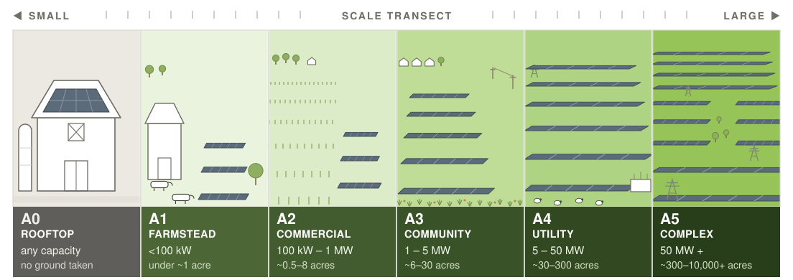

# The Scale Transect {#sec-transect}

Somebody chose five megawatts rather than eighty. It was decided early, on grounds of [interconnection](terminology.qmd#term-interconnection) and capital, probably before anyone walked the ground, and it set the limits on every choice the design had left. That decision is **scale**, the first of the six levers. It is how large the array is, and so how much ground it takes, and it is the lever most often mistaken for a fact about a site rather than something a person decided.

Scale gets a chapter because so much changes along with it. As projects get bigger, a lot shifts at once:

- **how the array connects to the grid:** behind the meter, then the local distribution line, then transmission
- **who decides:** one landowner, then several parties at a table, then a utility with a place in the interconnection queue
- **what it takes to permit:** allowed by right, then site plan review, then full environmental review
- **who manages the ground:** existing farm labor, then crews hired for the site, then an outside contractor
- **where the money comes from:** the owner's pocket, then tax equity and a power contract, then project finance

They shift together closely enough that knowing where a project sits on the range tells you a great deal about it at once. That range is the **[scale transect](terminology.qmd#term-scale-transect)**.

{#fig-scale-transect}

## Five zones on one gradient {#sec-zones}

The zones are calibration points on that range, in the sense urban planning's rural-to-urban transect uses the term: named places to stand, not boxes with walls. A 4 MW project and a 6 MW project differ by less than their labels suggest, and a project near a boundary should be read as sitting near one.

::: {.zone-table}
| Zone | Indicative capacity | Indicative footprint | Interconnection | Decision unit | Ground-layer management |
|---|---|---|---|---|---|
| **A1 — Farmstead** | <100 kW | under ~1 acre | Behind-the-meter, net metered | Single owner-operator | Existing farm labor and equipment |
| **A2 — Commercial** | 100 kW–1 MW | ~0.5–8 acres | Behind-meter to distribution | Landowner, possibly one lease counterparty | Existing equipment, modest adaptation |
| **A3 — Community** | 1–5 MW | ~6–30 acres | Distribution; community solar, mid-market power contract | Multi-party: landowner, developer, power buyer, tax equity | Purpose-built: dedicated mowing, contract grazing, seeded establishment |
| **A4 — Utility** | 5–50 MW | ~30–300 acres | Distribution to sub-transmission; queue position matters | Developer-led, institutional capital | Contract enterprise: commercial graziers, habitat contracts |
| **A5 — Complex** | 50 MW+ | ~300 acres to 10,000+ | Transmission; merchant or utility power contract | Utility or independent power producer, several jurisdictions | Contract enterprise at ranch scale; rotation across sites |
: The five zones, and the attributes that move together along them. The bands fit the US Midwest and should be redrawn elsewhere. {#tbl-zones}
:::

Capacity is how a project is filed. Acreage is how the people living with it experience it, and **when the two numbers disagree, acreage is the better guide**, because trackers and the extra [clearance](terminology.qmd#term-clearance) of agrivoltaic layouts use more land per megawatt [@gallaher2026]. Arrays on buildings are **[A0 — Rooftop](terminology.qmd#term-a0)**. They take no ground, so they sit at the starting point of the range rather than on it. At the other end, A5 has no upper limit.

## Scale decides who holds the other levers {#sec-master-lever}

Choosing five megawatts over eighty plants nothing and commits no one to anything. What it does is decide which of the other five levers a designer can still reach by the time the layout is drawn. **Scale is the master lever because it is settled before anyone reaches for the others**, and very little later in a project wins back what it closed off.

The ground itself shows how. At the farmstead the operator holds the whole decision and has almost nothing to choose among, since one spot in the yard may be the only spot. At A3 a developer and a landowner can walk the field together and put the array on the wet low spot that never yields. By A4 the ground is chosen by whatever acreage could be assembled near a substation with a place in the queue (§-@sec-siting-latitude). The other levers travel the same way. Racking at A1 is whatever a local installer can find for one yard, and at A5 it is a catalog item bought by the megawatt. Ownership moves furthest: one person at the farmstead, and an investor, a landowner, and a township by A5. Every lever survives the trip. None stays in the same hands.

::: {.callout-tip .running-example icon=false title="At Rabbit Hills"}
Its 1.4 megawatts on about six acres put Rabbit Hills in A3, the community zone, at the small end of the zone's acreage. At that size the array fits on a single pasture that one landowner already managed, and the university could go on grazing it with its own flock.
:::

**Go deeper:** the zone entries [A0](terminology.qmd#term-a0) to [A5](terminology.qmd#term-a5) in the Terminology · where the acreage numbers come from, the possible break inside A4, and grazing across the transect, in [In Depth](in-depth.qmd#sec-deep-transect) and the [Archetype Catalog](archetype-catalog.qmd#sec-grazing).
